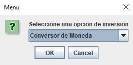
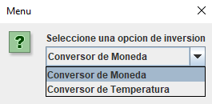
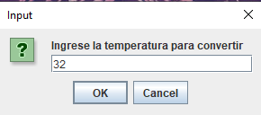
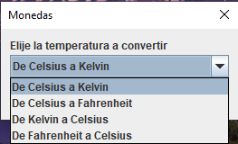

# Oracle ONE - Conversor

Esta es una solucion del challenge propuesto por Oracle ONE.

## Índice

- [Overview](#overview)
  - [El challenge](#the-challenge)
  - [Screenshot](#screenshot)
  - [Links](#links)
- [My process](#my-process)
  - [Contruido con](#built-with)
  - [Mejoras](#continued-development)
  - [Useful resources](#useful-resources)

## Overview

### El challenge

¡Bienvenido al primer desafío del Challenge Java!

En esta oportunidad, a los Devs se nos solicitó crear un conversor de divisas utilizando el lenguaje Java. Las características solicitadas por nuestro cliente son las siguientes:

** Requisitos: **
- El convertidor de moneda debe:

           - Convertir de la moneda de tu país a Dólar
           - Convertir de la moneda de tu país  a Euros
           - Convertir de la moneda de tu país  a Libras Esterlinas
           - Convertir de la moneda de tu país  a Yen Japonés
           - Convertir de la moneda de tu país  a Won sul-coreano

Recordando que también debe ser posible convertir inversamente, es decir:

           - Convertir de Dólar a la moneda de tu país
           - Convertir de Euros a la moneda de tu país
           - Convertir de Libras Esterlinas a la moneda de tu país
           - Convertir de Yen Japonés a la moneda de tu país
           - Convertir de Won sul-coreano a la moneda de tu país

**Extras:**
Como desafío extra te animamos a que dejes fluir tu creatividad, si puedo convertir divisas, ¿tal vez pueda añadir a mi programa otros tipos de conversiones como temperatura por ejemplo?

### Screenshot

- Pricipal

- Eleccion de Conversor

- Ingreso de Valor

- Elección de Unidades

- Resultado 

### Links

- Ejecutable URL: https://tinyurl.com/2an8sx8f

## My process

### Construido con

- Java
- JOptionPane

### Mejoras

Algunas mejoras a realizar a un futuro:

- Mejorar la interfaz gráfica haciendola más atractiva e intuituiva para el usuario.
- Agregar otros tipos de conversiones, por ejemplo de tiempo, distancia, etc.
- Realizar la conversión de moneda teniendo como referencia una API y no una variable estática.

### Useful resources

- JOptionPane: https://docs.oracle.com/javase/7/docs/api/javax/swing/JOptionPane.html

